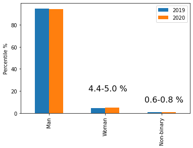

# stackoverflowsurvey
<!-- PROJECT LOGO -->
<br />
<p align="center">
  <a href="https://github.com/pxr-merida/stackoverflowsurvey">
    
  </a>

  <h3 align="center">stackoverflowsurvey</h3>

  <p align="center">
    This project provides a way to analyze stackoverflow survey data to get an insight for the coding comminity. 
    <br />
    <a href="https://github.com/pxr-merida/stackoverflowsurvey"><strong>Explore the docs »</strong></a>
    <br />
    <br />
    <a href="https://github.com/pxr-merida/stackoverflowsurvey">View Demo</a>
    ·
    <a href="https://github.com/pxr-merida/stackoverflowsurvey/issues">Report Bug</a>
    ·
    <a href="https://github.com/pxr-merida/stackoverflowsurvey/issues">Request Feature</a>
  </p>
</p>


<!-- TABLE OF CONTENTS -->
<details open="open">
  <summary><h2 style="display: inline-block">Table of Contents</h2></summary>
  <ol>
    <li>
      <a href="#about-the-project">About The Project</a>
      <ul>
        <li><a href="#built-with">Built With</a></li>
      </ul>
    </li>
    <li>
      <a href="#getting-started">Getting Started</a>
      <ul>
        <li><a href="#prerequisites">Prerequisites</a></li>
        <li><a href="#installation">Installation</a></li>
      </ul>
    </li>
    <li><a href="#usage">Usage</a></li>
    <li><a href="#roadmap">Roadmap</a></li>
    <li><a href="#contributing">Contributing</a></li>
    <li><a href="#contact">Contact</a></li>
==
  </ol>
</details>


<!-- ABOUT THE PROJECT -->
## About The Project

[![Product Name Screen Shot][product-screenshot]](https://example.com)


### Built With

* []()
* []()
* []()


<!-- GETTING STARTED -->
## Getting Started

To get a local copy up and running follow these simple steps.

### Prerequisites

This is an example of how to list things you need to use the software and how to install them.
* npm
  ```sh
  npm install npm@latest -g
  ```

### Installation

1. Clone the repo
   ```sh
   git clone https://github.com/pxr-merida/stackoverflowsurvey.git
   ```
2. Install NPM packages
   ```sh
   npm install
   ```


<!-- USAGE EXAMPLES -->
## Usage

You can draw conclusions by using multiple survey data from previous date: 

_For more examples, please refer to the (https://gulayse.medium.com/who-are-these-stackoverflow-people-f7bc0e1c3b9a)_


<!-- ROADMAP -->
## Roadmap

See the [open issues](https://github.com/pxr-merida/stackoverflowsurvey/issues) for a list of proposed features (and known issues).


<!-- CONTRIBUTING -->
## Contributing

Contributions are what make the open source community such an amazing place to be learn, inspire, and create. Any contributions you make are **greatly appreciated**.

1. Fork the Project
2. Create your Feature Branch (`git checkout -b feature/AmazingFeature`)
3. Commit your Changes (`git commit -m 'Add some AmazingFeature'`)
4. Push to the Branch (`git push origin feature/AmazingFeature`)
5. Open a Pull Request


<!-- CONTACT -->
## Contact

Project Link: [https://github.com/pxr-merida/stackoverflowsurvey](https://github.com/pxr-merida/stackoverflowsurvey)


